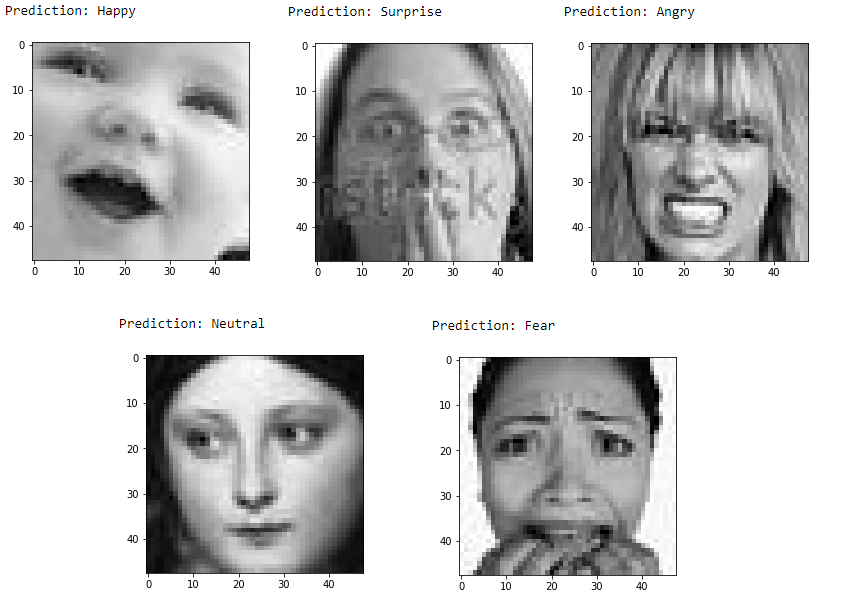

# Deep-Emotion: Facial Expression Recognition Using Attentional Convolutional Network

This repository provides a PyTorch implementation of the research paper, [Deep-Emotion](https://arxiv.org/abs/1902.01019).

**Note:** This implementation is not the official one described in the paper.

## Architecture
- An end-to-end deep learning framework based on attentional convolutional networks.
- The attention mechanism is incorporated using spatial transformer networks.

<p align="center">
  
</p>

## Datasets
This implementation uses the following datasets:
- [FER2013](https://www.kaggle.com/c/challenges-in-representation-learning-facial-expression-recognition-challenge/data)


## Prerequisites
Make sure you have the following libraries installed:
- PyTorch >= 1.1.0
- torchvision == 0.5.0
- OpenCV
- tqdm
- Pillow (PIL)

## Repository Structure
This repository is organized as follows:
- [`main`](/main.py): Contains setup for the dataset and training loop.
- [`visualize`](/visualize.py): Includes source code for evaluating the model on test data and real-time testing using a webcam.
- [`model`](/model.py): Defines the model class.
- [`data_loaders`](/data_loaders.py): Contains the dataset class.
- [`generate_data`](/generate_data.py): Sets up the [dataset](https://www.kaggle.com/c/challenges-in-representation-learning-facial-expression-recognition-challenge/data).


### Data Preparation
1. Download the dataset from [Kaggle](https://www.kaggle.com/c/challenges-in-representation-learning-facial-expression-recognition-challenge/data).
2. Decompress `train.csv` and `test.csv` into the `./data` folder.

### How to Run
**Setup the Dataset**
```bash
python main.py [-s [True]] [-d [data_path]]

--setup                 Setup the dataset for the first time
--data                  Data folder that contains data files
```

**To train the model**
```
python main.py [-t] [--data [data_path]] [--hparams [hyperparams]]
              [--epochs] [--learning_rate] [--batch_size]

--data                  Data folder that contains training and validation files
--train                 True when training
--hparams               True when changing the hyperparameters
--epochs                Number of epochs
--learning_rate         Learning rate value
--batch_size            Training/validation batch size
```

**To validate the model**
```
python visualize.py [-t] [-c] [--data [data_path]] [--model [model_path]]

--data                  Data folder that contains test images and test CSV file
--model                 Path to pre-trained model
--test_cc               Calculate the test accuracy
--cam                   Test the model in real-time with webcam connected via USB
```
## Prediction Samples
After prediction results are demonstrated here:

example prediction from paper:
<p align="center">
  
</p>
