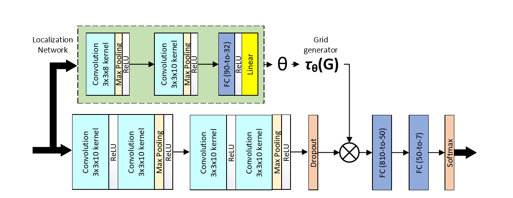
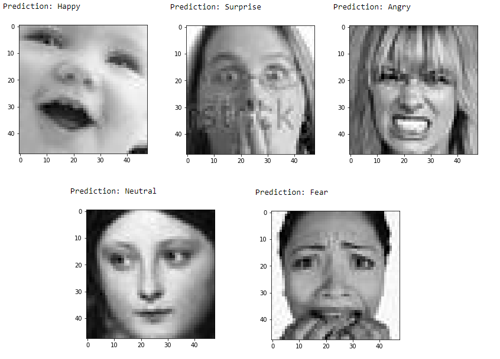

## Work In Progress
# Deep-Emotion: Facial Expression Recognition Using Attentional Convolutional Network

This repository provides a PyTorch implementation of the research paper, [Deep-Emotion](https://arxiv.org/abs/1902.01019).

**Note:** This implementation is not the official one described in the paper.

## Architecture
- An end-to-end deep learning framework based on attentional convolutional networks.
- The attention mechanism is incorporated using spatial transformer networks.

<p align="center">
  
</p>

## Datasets
This implementation uses the following datasets:
- [FER2013](https://www.kaggle.com/c/challenges-in-representation-learning-facial-expression-recognition-challenge/data)

## Prerequisites
Make sure you have the following libraries installed:
- PyTorch >= 1.1.0
- torchvision == 0.5.0
- OpenCV
- tqdm
- Pillow (PIL)

## Repository Structure
This project is organized as follows:
- [`emotion_detector.py`](./emotion_detector.py): CLI runner for model loading, evaluation, and webcam inference.
- [`deep_emotion_model.py`](./deep_emotion_model.py): Defines the `DeepEmotionModel` class.
- [`imgs/`](./imgs): Architecture and prediction sample images.

### Data Preparation
1. Download the dataset from [Kaggle](https://www.kaggle.com/c/challenges-in-representation-learning-facial-expression-recognition-challenge/data).
2. Arrange the test dataset in ImageFolder format (one folder per class label).

### How to Run
**Evaluate test accuracy**
```bash
python emotion_detector.py --model <model_path> --data <test_data_dir> --test_acc
```

- `--model`: Path to pretrained model checkpoint (`.pth`).
- `--data`: Root test data directory in ImageFolder structure.
- `--test_acc`: Calculate test accuracy.

**Run webcam inference**
```bash
python emotion_detector.py --model <model_path> --data <test_data_dir> --webcam
```

- `--webcam`: Run real-time prediction with a connected webcam.

--data                  Data folder that contains test images and test CSV file
--model                 Path to pre-trained model
--test_cc               Calculate the test accuracy
--cam                   Test the model in real-time with webcam connected via USB
```
## Prediction Samples
After prediction results are demonstrated here:

example prediction from paper:
<p align="center">
  
</p>
